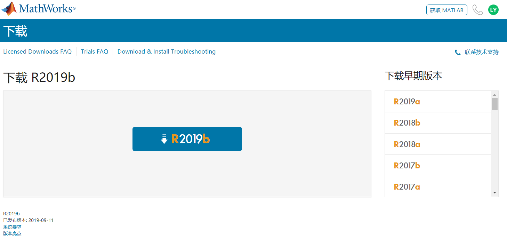
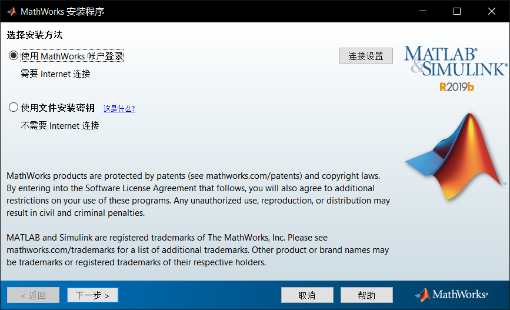
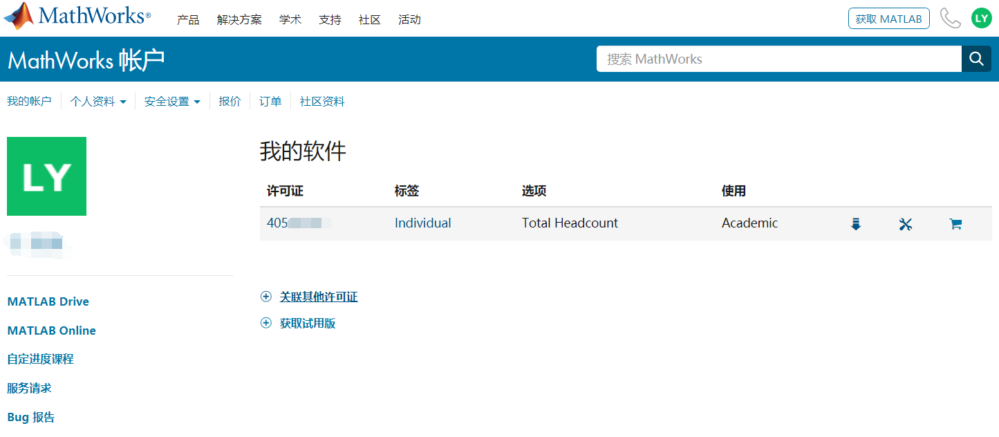

# Matlab

## 获取许可证

1. 用学校邮箱注册 `MathWorks` 账号（必须为学校邮箱否则无法使用）[入口](https://ww2.mathworks.cn/login?uri=%2Fmwaccount%2F)
2. 关联许可证到 `MathWorks` 账号

若有疑问可以咨询 `MathWorks` 客服或者易老师：yiha\_\_at\_\_mail.sustech.edu.cn
 
### 注册时选择学校教学或研究

 
### 关联许可证

Activation Key（不可混用）: 
* 38686-15180-56642-23583-92647 (学生使用，带mail后缀)
* 84019-13881-08610-96595-44155（老师使用，不带mail后缀）

## 安装包下载

1. [Mathlab官方地址](https://cn.mathworks.com/downloads/web_downloads/download_release)
2. FTP（仅限校内访问）
    * [ftp://172.18.4.47:30/](ftp://172.18.4.47:30/)
    * 用户名：matlabUser 
    * 密码：Matlab2016
 
## 激活

1. 安装时选择 `MathWorks` 账户登录即可。

    

## 参考链接
* [南科大正版matlab安装激活指南 © Math.sustc](http://math.sustech.edu.cn/media/download_files/%E5%8D%97%E7%A7%91%E5%A4%A7%E6%AD%A3%E7%89%88matlab%E5%AE%89%E8%A3%85%E6%BF%80%E6%B4%BB%E6%8C%87%E5%8D%97.docx)